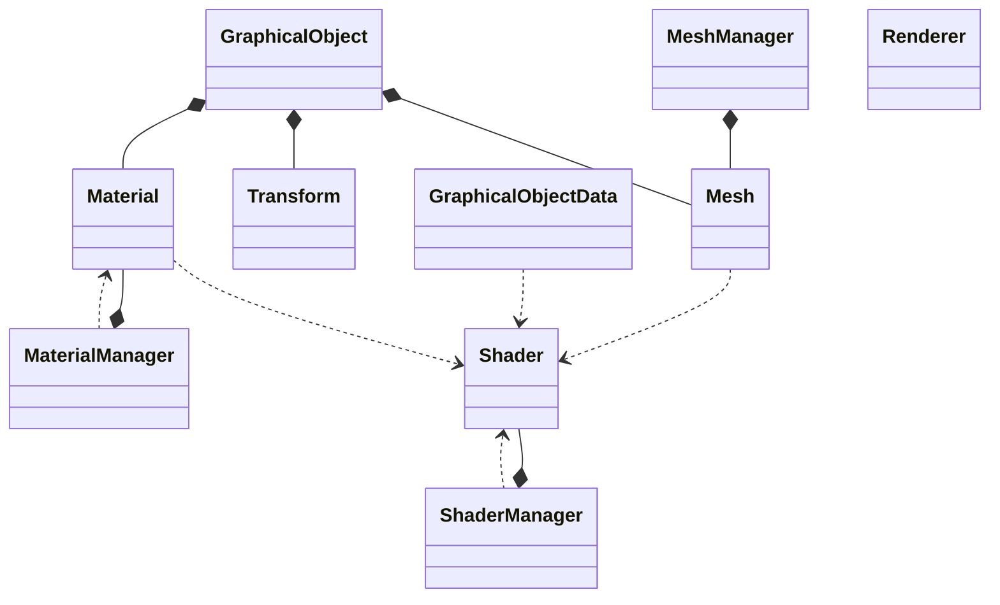

```mermaid
classDiagram
    class GraphicalObject
    class MeshManager
    class Mesh
    class Transform
    class GraphicalObjectData
    class MaterialManager
    class Material
    class ShaderManager
    class Shader
    class Renderer
    GraphicalObject *-- Mesh
    GraphicalObject *-- Transform
    GraphicalObject *-- Material
    Shader <.. ShaderManager
    ShaderManager *-- Shader
    MeshManager *-- Mesh
    MaterialManager *-- Material
    Material <.. MaterialManager
	Material ..> Shader
	GraphicalObjectData ..> Shader
	Mesh ..> Shader
```
